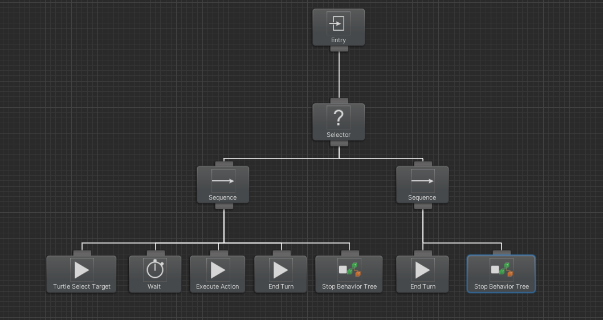

# IAV Proyecto Final - IA para enemigos en un RPG por turnos

## Autores
### *José María Gómez Pulido (jgomez18UCM)*

## Propuesta

Mi propuesta para este proyecto es crear un RPG por turnos con las siguientes características:
- Dos personajes controlados por el jugador, que pueden, en su turno, hacer una de las siguientes acciones:
    - Curar a un aliado
    - Atacar a un enemigo
    - Dar un aumento de daño a un aliado por 10 turnos
- Un tipo de enemigo *Slime* con el siguiente comportamiento en cada truno:
    - Intenta aumentar el daño de todos sus aliados (excepto él mismo) que no tengan un aumento de daño activo (Su aumento de daño dura 2 turnos). Mantiene el aumento en todos los aliados que sea posible. Si hay varios aliados aplicables, elige uno aleatoriamente.
    - Si no hay aliados aplicables para el aumento de daño, ataca al héroe con menos vida disponible. Si ambos héroes tienen la misma vida, ataca a uno aleatorio.
- Un tipo de enemigo *Tortuga* con el siguiente comportamiento:
    - Ataca al héroe con menos vida disponible. Si ambos héroes tienen la misma vida, ataca a uno aleatorio.
    - En caso de estar por debajo de 10 puntos de vida, se cura a sí mismo 5 puntos de vida.

Además, como aspectos generales:
- El juego dispone de una interfaz básica, en la que se muestran las barras de vida de héroes y enemigos; si tienen un aumento de ataque activo, y por cuantos turnos estará activo; qué turno se está ejecutando; y, por último, en caso de que el turno activo sea de uno de los héroes, con qué teclas se pueden activar los distintos comandos disponibles.
- Se disponen de dos botones para reiniciar el combate, y otro para cerrar el juego.

## Punto de partida

He partido desde un proyecto vacío, usando los paquetes listados en [Referencias y paquetes](#referencias-y-paqutes).

## Diseño de la solución

El funcionamiento principal del juego está en los scripts RPGManager y RPGActor.
Sus funcionamientos son los siguientes:
- El script ***RPGManager*** se encarga de **repartir los turnos** y gestiona el **bucle de juego**.
Su funcionamiento básico consiste en que al principio del juego **reparte los turnos aleatoriamente** en una cola. Por otra parte, se encarga de **gestionar el comienzo y final** de los turnos de cada actor. Por último, también gestiona el cierre de la aplicación y el reinicio de la escena.
- El script ***RPGActor*** es un script base para las **entidades del juego**. Almacena las **acciones** disponibles, los **puntos de vida** de las entidades, los **aumentos** de daño y los bucles de ejecución de sus **turnos**. A continuación explico sus dos especializaciones encargadas de gestionar a los enemigos y a los personajes jugables.
    - El script ***PlayerActor*** se encarga de gestionar el **input** del jugador para que ambos héroes ejecuten sus acciones. Los controles son los siguientes:
        - Se utilizan las teclas **1**, **2** y **3** para ejecutar las tres diferentes acciones:
        *Ataque*, *Curación* y *Aumento de daño*, respectivamente.
        - Dependiendo de la acción seleccionada, se iluminará en rojo la barra de vida de uno de los enemigos o héroes, entonces se podrán utilizar las **flechas arriba y abajo** para *seleccionar a un objetivo*, la tecla **Enter** para *confirmar objetivo* (que hará que el héroe activo ejecute la acción y terminará el turno) o la tecla **Esc** para *volver* a la *selección de acciones*.
    - El script ***EnemyActor*** se encarga de activar los árboles de comportamiento de los enemigos en cada turno.

A continuación está el árbol de comportamiento que utilizan los enemigos (El Slime cambia la primera tarea por Slime select target):

La mayoría de la funcionalidad de los enemigos está implementada en las acciones de **Select Target**, que se encargan de seleccionar la acción a ejecutar y el objetivo más apropiado, tal y como está detallado en [Propuesta](#propuesta) para ambos enemigos.

Los nodos **Stop Behavior Tree** están ahí porque el behavior tree está marcado como Restart on Complete, así al reiniciarse el árbol en cada turno, me aseguro de que vuelva a comenzar.

Además en caso de que **falle** la tarea de Select Target o Execute Action, me aseguro de que los turnos terminan con el **selector** y el **segundo árbol** de secuencia.

## Pruebas y métricas

- [Vídeo con la batería de pruebas](https://youtu.be/QM7yfxHrFJE)

## Referencias y Paqutes

Los recursos de terceros utilizados son de uso público, excepto Behavior Designer, que es el proporcionado por el Profesor en las prácticas 3 y 4.

- *AI for Games*, Ian Millington.
- [Behavior Designer](https://opsive.com/assets/behavior-designer/)
- [RPG Monster Duo PBR Polyart](https://assetstore.unity.com/packages/3d/characters/creatures/rpg-monster-duo-pbr-polyart-157762)
- [RPG Tiny Hero Duo PBR Polyart](https://assetstore.unity.com/packages/3d/characters/humanoids/rpg-tiny-hero-duo-pbr-polyart-225148)
- [Fantasy Environments](https://assetstore.unity.com/packages/3d/environments/fantasy-landscape-103573)
- [Fantasy Inventory Icons [Free]](https://assetstore.unity.com/packages/2d/gui/icons/fantasy-inventory-icons-free-143805)
- [RPG Essentials Sound Effects - FREE!](https://assetstore.unity.com/packages/audio/sound-fx/rpg-essentials-sound-effects-free-227708)

Nota: Hay código repartido en varios scripts que no tiene uso en esta versión. Pero tengo intención de continuar con este proyecto en verano, osea que lo he dejado para no tener que rehacerlo después. 